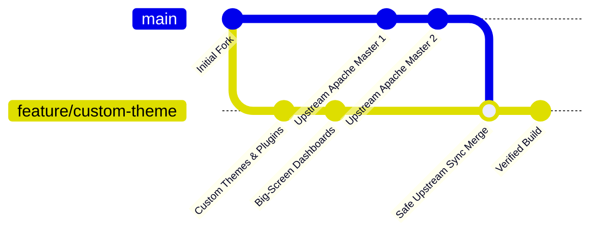

<!--
Licensed to the Apache Software Foundation (ASF) under one
or more contributor license agreements.  See the NOTICE file
distributed with this work for additional information
regarding copyright ownership.  The ASF licenses this file
to you under the Apache License, Version 2.0 (the
"License"); you may not use this file except in compliance
with the License.  You may obtain a copy of the License at

  http://www.apache.org/licenses/LICENSE-2.0

Unless required by applicable law or agreed to in writing,
software distributed under the License is distributed on an
"AS IS" BASIS, WITHOUT WARRANTIES OR CONDITIONS OF ANY
KIND, either express or implied.  See the License for the
specific language governing permissions and limitations
under the License.
-->

# OpsPilot (Custom Superset) Deployment & Synchronization Guide

This document is the official, end-to-end operational manual for deploying, running, and maintaining the **OpsPilot** customized Apache Superset platform on any target server (Linux, Windows Server, or macOS). It also provides step-by-step instructions for synchronizing our customized repository with the upstream official Apache Superset project.

---

## 📑 Table of Contents

1. [System Requirements & Architecture](#1-system-requirements--architecture)
2. [First-Time Server Installation & Deployment](#2-first-time-server-installation--deployment)
3. [Seeding OpsPilot Big-Screen Dashboards](#3-seeding-opspilot-big-screen-dashboards)
4. [Day-to-Day Operations & Service Management](#4-day-to-day-operations--service-management)
5. [Pulling & Deploying New OpsPilot Updates to the Server](#5-pulling--deploying-new-opspilot-updates-to-the-server)
6. [Upstream Apache Superset Synchronization Guide](#6-upstream-apache-superset-synchronization-guide)
7. [Frontend Development & Rebuilding Custom Plugins](#7-frontend-development--rebuilding-custom-plugins)
8. [Troubleshooting & Common Operational Issues](#8-troubleshooting--common-operational-issues)

---

## 1. System Requirements & Architecture

OpsPilot is built on Apache Superset with custom dark-mode industrial themes, high-contrast big-screen TV layouts, and specialized chart plugins (`plugin-chart-kpi-dual-column-card`, `plugin-chart-unified-list-bar`, `plugin-chart-custom-gauge`, etc.).

### Hardware Recommendations

| Specification | Minimum | Recommended (Production / TV Displays) |
|---|---|---|
| **CPU** | 4 Cores | 8 Cores or higher |
| **RAM** | 8 GB (Docker allocated 6 GB+) | 16 GB - 32 GB |
| **Disk Storage** | 30 GB SSD | 60+ GB SSD (for Docker images and cache) |
| **Network** | 100 Mbps | 1 Gbps |

### Software Prerequisites

1. **Operating System**: Linux (Ubuntu 22.04/24.04 LTS recommended), Debian, RHEL, Windows 10/11 / Windows Server with WSL2, or macOS.
2. **Docker Engine**: Version `24.0+` or [Docker Desktop](https://www.docker.com/products/docker-desktop/).
3. **Docker Compose**: Plugin version `v2.20+` (`docker compose version`).
4. **Git**: Version `2.30+`.
5. **Open Network Ports**:
   - `80`: Nginx Reverse Proxy (main entrypoint for end-users)
   - `8088`: Superset backend API (internal or direct access)
   - `8080`: Superset WebSocket service (for live dashboard async events)
   - `5432`: PostgreSQL database (bound to `127.0.0.1` by default)
   - `6379`: Redis cache (bound to `127.0.0.1` by default)

---

## 2. First-Time Server Installation & Deployment

Follow these exact steps when provisioning OpsPilot on a brand-new server.

### Step 2.1: Clone the Repository

Clone the customized OpsPilot repository and checkout the active deployment branch (`feature/custom-theme`):

```bash
# Clone the repository
git clone https://github.com/pran786/Opspilot.git
# Note: If accessing via the original mirror:
# git clone https://github.com/pran786/eenera-llc-superset.git

# Enter project directory
cd Opspilot  # or cd eenera-llc-superset

# Checkout the customized production branch
git checkout feature/custom-theme
```

---

### Step 2.2: Environment Configuration

OpsPilot uses environment files located in `docker/`. Ensure default configurations exist:

```bash
# On Linux / macOS:
cp -n docker/.env-local.example docker/.env-local 2>/dev/null || touch docker/.env-local

# Verify the base environment file exists:
ls -la docker/.env
```

> **Security Note:** In production, open `docker/.env` or `docker/.env-local` and update:
> - `SUPERSET_SECRET_KEY`: Set to a strong random string (e.g. generated via `openssl rand -base64 42`).
> - Database and Redis passwords if exposing services beyond localhost.

---

### Step 2.3: Build & Launch Docker Services

You can deploy using either the **Fast Compose** stack (recommended for fast rebuilds) or the **Standard Compose** stack:

#### Option A: Fast Compose (Recommended)

```bash
# Build the application container images
docker compose -f docker-compose-fast.yml build

# Launch the services in detached (background) mode
docker compose -f docker-compose-fast.yml up -d
```

#### Option B: Standard Compose

```bash
# Build and launch all services
docker compose up -d --build
```

---

### Step 2.4: Initialize Database & Create Admin User

Once the containers are running, execute database migrations and initialize credentials:

```bash
# 1. Apply database migrations
docker compose -f docker-compose-fast.yml exec -T superset superset db upgrade

# 2. Create the Admin User (replace credentials as needed)
docker compose -f docker-compose-fast.yml exec -T superset superset fab create-admin \
    --username admin \
    --firstname Superset \
    --lastname Admin \
    --email admin@opspilot.com \
    --password admin

# 3. Initialize roles and system permissions
docker compose -f docker-compose-fast.yml exec -T superset superset init
```

*(If using standard `docker-compose.yml`, omit the `-f docker-compose-fast.yml` flag).*

---

### Step 2.5: Verify Service Health

Check that all containers are healthy:

```bash
docker compose -f docker-compose-fast.yml ps
```

Expected running containers:
- `nginx` (port 80)
- `superset` (port 8088)
- `superset-worker`
- `superset-worker-beat`
- `superset-websocket` (port 8080)
- `db` (Postgres 16)
- `redis` (Redis 7)

---

## 3. Seeding OpsPilot Big-Screen Dashboards

OpsPilot includes a master automated seed script that automatically creates the PostgreSQL `examples` database schema, generates realistic industrial dataset tables, configures all custom chart plugins, and publishes the 4 key TV dashboards.

Run the master seed command inside the running Superset container:

```bash
docker compose -f docker-compose-fast.yml exec -T superset python scripts/seed_all_opspilot_dashboards.py
```

This sequentially creates and configures:
1. **1-Receiving** Dashboard (`/opspilot/dashboard/1-receiving/?standalone=3`)
2. **2-WH Replenishment** Dashboard (`/opspilot/dashboard/2-wh-replenishment/?standalone=3`)
3. **3-ToteFarm** Dashboard (`/opspilot/dashboard/3-totefarm/?standalone=3`)
4. **5-Small Pours** Dashboard (`/opspilot/dashboard/5-small-pours/?standalone=3`)

### Accessing the Dashboards

Open your web browser and navigate to:
- **Through Nginx (Port 80 - Recommended):**  
  `http://<SERVER_IP_OR_HOSTNAME>/opspilot/welcome/`
- **Direct Backend (Port 8088):**  
  `http://<SERVER_IP_OR_HOSTNAME>:8088/opspilot/welcome/`
- **TV Kiosk Mode (Full screen, no header/menus):**  
  `http://<SERVER_IP_OR_HOSTNAME>/opspilot/dashboard/1-receiving/?standalone=3`  
  `http://<SERVER_IP_OR_HOSTNAME>/opspilot/dashboard/2-wh-replenishment/?standalone=3`  
  `http://<SERVER_IP_OR_HOSTNAME>/opspilot/dashboard/3-totefarm/?standalone=3`  
  `http://<SERVER_IP_OR_HOSTNAME>/opspilot/dashboard/5-small-pours/?standalone=3`

---

## 4. Day-to-Day Operations & Service Management

### Check Logs

```bash
# Follow logs for all services
docker compose -f docker-compose-fast.yml logs -f

# Follow logs for Superset backend only
docker compose -f docker-compose-fast.yml logs -f superset

# Follow logs for Nginx web server
docker compose -f docker-compose-fast.yml logs -f nginx
```

### Restart Services

```bash
# Restart the entire stack
docker compose -f docker-compose-fast.yml restart

# Restart Superset backend worker only
docker compose -f docker-compose-fast.yml restart superset
```

### Stop & Start Services

```bash
# Gracefully stop containers without losing database data
docker compose -f docker-compose-fast.yml stop

# Start existing stopped containers
docker compose -f docker-compose-fast.yml start

# Tear down containers and private networks (preserves named volumes)
docker compose -f docker-compose-fast.yml down
```

---

## 5. Pulling & Deploying New OpsPilot Updates to the Server

When new bug fixes, custom charts, or dashboard designs are pushed to the GitHub repository:

```bash
# 1. Navigate to the project directory
cd ~/Opspilot  # or your deployment directory

# 2. Fetch and pull the latest changes
git pull origin feature/custom-theme

# 3. Rebuild and restart the containers with updated code
docker compose -f docker-compose-fast.yml up -d --build

# 4. Run database migrations (in case new schema migrations were added)
docker compose -f docker-compose-fast.yml exec -T superset superset db upgrade

# 5. (Optional) Re-seed dashboards if queries or card designs were modified
docker compose -f docker-compose-fast.yml exec -T superset python scripts/seed_all_opspilot_dashboards.py
```

---

## 6. Upstream Apache Superset Synchronization Guide

Our repository is a customized fork of official [Apache Superset](https://github.com/apache/superset). To incorporate new features, bug fixes, or security patches from official Apache Superset releases without overwriting our customizations, follow this structured synchronization protocol.



### Step 6.1: Setup Git Remotes (One-Time Setup)

Check your existing remotes:
```bash
git remote -v
```

If `upstream` is not listed, configure it:
```bash
# Add official Apache Superset as upstream
git remote add upstream https://github.com/apache/superset.git

# Verify remotes
git remote -v
# Output should display:
# origin    https://github.com/pran786/Opspilot.git (fetch & push)
# upstream  https://github.com/apache/superset.git (fetch & push)
```

---

### Step 6.2: Fetch Upstream Changes

Fetch all official tags and branches from Apache Superset:
```bash
git fetch upstream --tags
git fetch upstream master
```

---

### Step 6.3: Create an Isolated Sync Branch

Never merge directly on the live production branch. Always test in an isolated sync branch:

```bash
# Ensure current custom branch is clean and up-to-date
git checkout feature/custom-theme
git pull origin feature/custom-theme

# Create a temporary sync branch
git checkout -b sync/upstream-$(date +%Y%m%d)
```

---

### Step 6.4: Merge Upstream Changes

Merge official Apache Superset `master` (or a specific stable release tag, e.g. `v4.1.0`):

```bash
# Option A: Sync with latest official master
git merge upstream/master

# Option B: Sync with a specific official release tag (safer for enterprise)
# git merge tags/4.1.1 -m "chore: sync with upstream Superset v4.1.1"
```

---

### Step 6.5: Conflict Resolution Rules (Protecting OpsPilot Customizations)

If merge conflicts arise, use the following rules to keep our custom features intact:

| File / Directory | Resolution Strategy |
|---|---|
| `superset-frontend/plugins/plugin-chart-*` | **KEEP OURS (`feature/custom-theme`)**: These contain our custom charts (`kpi-dual-column-card`, `unified-list-bar`, `custom-gauge`, etc.). |
| `scripts/seed_*.py` | **KEEP OURS**: These are our proprietary dashboard seeding automations. |
| `docker/docker-init.sh` | **KEEP OURS**: Contains explicit migration directory fixes and initialization scripts. |
| `docker-compose-fast.yml` & `docker-compose-runtime.yml` | **KEEP OURS**: Custom development and fast deployment compose files. |
| `superset-frontend/package.json` | **CAUTION**: Keep custom plugin dependencies in `dependencies` and verify `optionalDependencies` for platform binaries (`@swc/core-*`). |
| `superset/extensions/__init__.py` | **KEEP OURS**: Contains the normalized absolute `APP_DIR` path fix. |
| `superset/config.py` & `superset_config.py` | **MERGE**: Keep upstream configuration additions while preserving our custom logo, colors, branding, and feature flags. |

---

### Step 6.6: Validate & Build After Merge

After resolving any conflicts:

```bash
# 1. Commit the merge resolution
git commit -m "chore(sync): merge upstream changes into custom-theme"

# 2. Build and run containers locally to verify stability
docker compose -f docker-compose-fast.yml up -d --build

# 3. Test database migrations
docker compose -f docker-compose-fast.yml exec -T superset superset db upgrade

# 4. Test dashboard seeding
docker compose -f docker-compose-fast.yml exec -T superset python scripts/seed_all_opspilot_dashboards.py
```

---

### Step 6.7: Push Verified Sync to Origin

Once everything is tested and working properly:

```bash
# Switch back to feature/custom-theme
git checkout feature/custom-theme

# Fast-forward merge the tested sync branch
git merge sync/upstream-$(date +%Y%m%d)

# Push the synchronized branch to GitHub
git push origin feature/custom-theme

# (Optional) Delete the local sync branch
git branch -d sync/upstream-$(date +%Y%m%d)
```

---

## 7. Frontend Development & Rebuilding Custom Plugins

If modifying custom React charts or UI elements:

### Running Frontend in Hot-Reload Development Mode (Port 9000)

```bash
# 1. Start backend containers
docker compose -f docker-compose-fast.yml up -d

# 2. Enter frontend directory
cd superset-frontend

# 3. Install packages
npm install

# 4. Start Webpack dev server
npm run dev-server
```
Dev server will run on `http://localhost:9000/opspilot/welcome/` with instant hot-module replacement (HMR).

### Building Production Frontend Assets

```bash
cd superset-frontend
npm run build
```

---

## 8. Troubleshooting & Common Operational Issues

### 1. "Invalid username and password" on Login
- **Cause:** Database was initialized without running `superset fab create-admin` or password was not set.
- **Fix:** Run inside the running container:
  ```bash
  docker compose -f docker-compose-fast.yml exec -T superset superset fab create-admin \
      --username admin \
      --firstname Superset \
      --lastname Admin \
      --email admin@opspilot.com \
      --password admin
  
  docker compose -f docker-compose-fast.yml exec -T superset superset init
  ```
- **If user already exists, reset password:**
  ```bash
  docker compose -f docker-compose-fast.yml exec -T superset superset fab reset-password \
      --username admin \
      --password admin
  ```

---

### 2. `EBADPLATFORM: Unsupported platform for @swc/core-win32-x64-msvc` during `npm install`
- **Cause:** A platform-specific native binary was listed directly under `devDependencies` in `package.json`.
- **Fix:** Ensure `@swc/core-win32-x64-msvc` is removed from `package.json` devDependencies. The root `@swc/core` package will automatically install the appropriate architecture binary for Linux, Mac, or Windows via `optionalDependencies`.
  ```bash
  npm install --prefer-online
  ```

---

### 3. Port Conflicts (`Port 80` or `Port 8088` already in use)
- **Cause:** Another web server (e.g. Apache, IIS, Nginx host) is occupying port 80 or 8088.
- **Fix:** Change the host port mapping in `docker/.env` or `docker/.env-local`:
  ```bash
  NGINX_PORT=8085
  SUPERSET_PORT=8089
  ```
  Then restart containers:
  ```bash
  docker compose -f docker-compose-fast.yml up -d
  ```
  Access the web app at `http://<SERVER_IP>:8085/`.

---

### 4. Database Migration Fails (`Pending database migrations` or Alembic error)
- **Cause:** Database container was stopped mid-migration or needs explicit migration directory.
- **Fix:** Run the upgrade command directly:
  ```bash
  docker compose -f docker-compose-fast.yml exec -T superset superset db upgrade
  ```

---

### 5. Docker Containers Not Starting / Health Check Timeouts
- **Check container status:**
  ```bash
  docker compose -f docker-compose-fast.yml ps
  ```
- **Inspect container logs:**
  ```bash
  docker compose -f docker-compose-fast.yml logs --tail=100 superset
  docker compose -f docker-compose-fast.yml logs --tail=100 db
  ```
- **Verify database connectivity:**
  ```bash
  docker compose -f docker-compose-fast.yml exec -T db pg_isready -U superset
  ```

---

## 📞 Support & Maintenance

For changes to custom dashboard logic, SQL datasets, or custom chart plugins, refer to the files in:
- `scripts/seed_*.py`
- `superset-frontend/plugins/`
- `docker/pythonpath_dev/superset_config.py`
